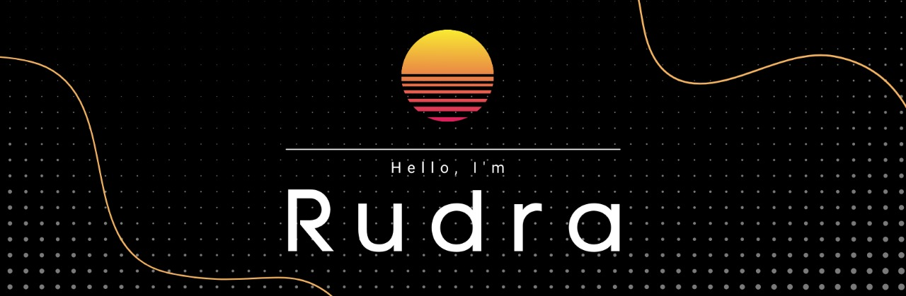

 

### Hi,  I'm Rudra Tiwari  

- 🎓 CSE Undergraduate at MANIT Bhopal
- 🔭 Currently I'm working on my Android Development Skills 
- 🌱 I’m always ready to collaborate and learn new skills
-  🖥 Enhancing my tech skills 
- 📝 [Resume](https://drive.google.com/file/d/1J_USD43X3u-zqY8Y31zkXflUBT0o0JJf/view?usp=sharing)

